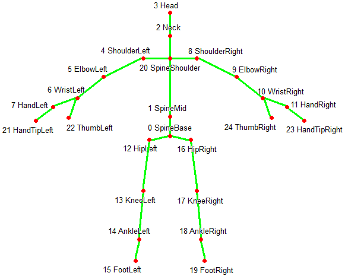

# TED Gesture-Type Dataset

This repository contains Youtube Gesture-Type Dataset and scripts for dividing videos.  

## Download
You can download TED Gesture-Type Dataset from [here](https://drive.google.com/file/d/1QwXCnCPIC0TiVDY_K3Gq0iGVeYXkhvwl/view?usp=sharing)

## Data Structure
You can load the dataset with the following code.
```python
    import pickle
    data = pickle.load(open('TED_gesture-type_dataset.pickle', "rb"))
``` 

The data is dictionary type, with 9 variables, each containing 13,736 gestures.

- vid_id : YouTube video ID
- gesture_id : Gesture ID
- gesture_type : Gesture types. This is annotated with either Beat, Imagistic or No-Gesture.
- start_frame_no : Gesture start frame in YouTube video 
- end_frame_no : Gesture end frame in YouTube video 
- text  : speech sentence
- remark : Words expressed as gestures in text. This is annotated only for Imagistic.
- word_timestamp : Word and the time it was uttered.
- skeletons : 3D pose sequence. The definition of joints follows the Kinect format as shown in the image below.




## Getting Gesture Videos
If you need videos for each gesture, run the following script.
Install ffmpeg and verify that the data path is correct in the script.

```
pip install -r requirements.txt
python youtube_dl.py 
python segment_videos.py
``` 

## Citation 
```
@misc{https://doi.org/10.48550/arxiv.2210.06790,
  doi = {10.48550/ARXIV.2210.06790},
  url = {https://arxiv.org/abs/2210.06790},
  author = {Teshima, Hitoshi and Wake, Naoki and Thomas, Diego and Nakashima, Yuta and Kawasaki, Hiroshi and Ikeuchi, Katsushi},
  title = {Deep Gesture Generation for Social Robots Using Type-Specific Libraries},
  publisher = {arXiv},
  year = {2022}
}
```
This dataset is based on the [YouTube Gesture Dataset](https://github.com/youngwoo-yoon/youtube-gesture-dataset) by Yoon et al.
```
@INPROCEEDINGS{
  yoonICRA19,
  title={Robots Learn Social Skills: End-to-End Learning of Co-Speech Gesture Generation for Humanoid Robots},
  author={Yoon, Youngwoo and Ko, Woo-Ri and Jang, Minsu and Lee, Jaeyeon and Kim, Jaehong and Lee, Geehyuk},
  booktitle={Proc. of The International Conference in Robotics and Automation (ICRA)},
  year={2019}
}
```
